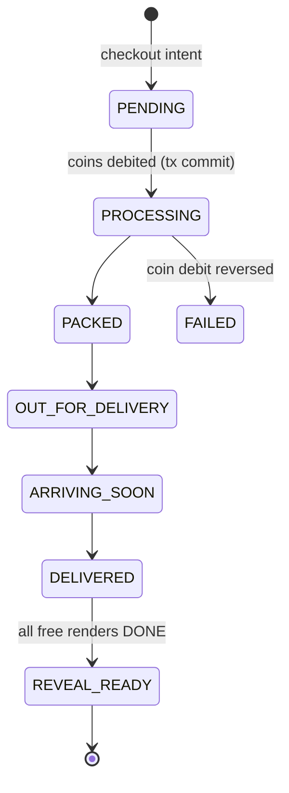
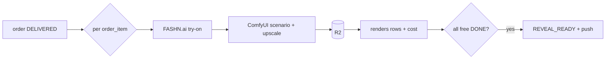

# WORN — Implementation Plan

> Engineering execution plan derived from `worn-spec.html` (Product Spec v1.0).
> Product: a fashion marketplace where the **shopping arc is the product**. Nothing ships; the reward is AI renders of the user wearing what they "bought."
> Scope of this doc: full system architecture + a task-level plan for **Phase I (MVP)**, with Phases II–IV at milestone level.

---

## 0. Reality checks on the spec (read first)

The spec is directionally strong but makes a few technical assumptions that will break if taken literally. Resolve these before building.

| Spec claim | Reality | Plan |
|---|---|---|
| "Every item you browse renders on you, **real-time**, in the feed" | Per-user, per-card live try-on is too slow (seconds/render) and too expensive at scroll speed. | Feed shows product on a **house model / flat-lay**. The "you in it" render fires on **item-detail open**, is **cached** per (user, item, variant), and the **top N feed items are pre-warmed** in the background. Promise preserved, cost controlled. |
| "Stored **avatar embeddings**" fed to FASHN.ai | FASHN.ai (and most try-on APIs) take a **model image + garment image**, not a persistent embedding. | Avatar = a canonical, pose-normalized **reference model image** (1–3) stored in R2. Identity consistency across scenarios comes from reusing that reference + optional per-user IP-Adapter/LoRA later (Phase IV). |
| "On-device embedding extraction, no raw photo storage" | Try-on runs server-side; the reference image must persist to render future orders. | Be honest: encrypted at-rest storage, short retention of *uploads* (delete originals after deriving the reference), strict access control, hard-delete flow. On-device is a Phase IV aspiration, not an MVP claim. |
| Reveal = 6–8 cinematic renders per order, pre-generated | This is the **cost center**. 8 renders × every order can exceed coin revenue/order. | Pre-generate the **2 free** renders always; generate paywalled renders **lazily on unlock** OR pre-generate all and price the unlock to cover cost. Default MVP: pre-gen 2 free + generate rest on unlock. Revisit with data. |
| "Express is 2 hours" wait | Good for dopamine, bad for first-run validation — beta users won't wait 2h to see the core moment. | Make tier durations **config-driven** (already needed for the A/B open question). Beta builds use compressed timers (e.g. Express = 5 min) to validate the reveal; production uses real timers. |

**The moat is the render pipeline.** Everything else is standard ecomm plumbing. Budget the most engineering risk and spike time there first (Week 2).

---

## 1. Approach & guiding constraints

- **Build Phase I end-to-end first.** One thin vertical slice of the full loop (avatar → feed → checkout → wait → reveal) beats six half-built surfaces. The bet to validate: *does the reveal moment land emotionally?* Nothing else matters until that's true.
- **Architecture must extend to II–IV** without rewrites (seller marketplace, coin earning, premium packs, self-hosted GPU).
- **India-first, global-ready.** Spec uses ₹/INR and Razorpay; phone-OTP auth fits India. Stripe + multi-currency are abstracted behind a payments interface.
- **Mobile-first**, single codebase (Expo / React Native), iOS + Android.
- **Cost is a first-class constraint.** Every render is metered, attributed to a user/order, and capped.

---

## 2. System architecture

**Monorepo** (pnpm workspaces + Turborepo):

```
worn/
├─ apps/
│  ├─ mobile/        # Expo Router app (iOS + Android)
│  └─ api/           # Fastify HTTP API
├─ services/
│  ├─ worker-orders/ # BullMQ consumer: order state machine + timers
│  └─ worker-render/ # BullMQ consumer: render pipeline orchestration
├─ packages/
│  ├─ shared/        # zod schemas, DTOs, shared TS types, constants (coin prices, tier timings)
│  ├─ db/            # Drizzle schema + migrations + query helpers
│  └─ config/        # env loading/validation (zod), tsconfig, eslint
└─ infra/            # docker-compose (local pg/redis), deploy manifests
```

**Runtime topology:**

```
Expo app ──HTTPS──▶ Fastify API ──▶ Postgres (source of truth)
                         │            Redis (BullMQ queues + order timers + cache)
                         │            Cloudflare R2 (images: uploads, references, renders)
                         ▼
              BullMQ delayed jobs
                ├─ worker-orders ─▶ state transitions ─▶ push (Expo/FCM)
                └─ worker-render ─▶ FASHN.ai / ComfyUI ─▶ R2 ─▶ mark REVEAL_READY ─▶ push
```

**Key choices (decisive defaults; swap notes inline):**
- **API:** Fastify + `@fastify/zod` for typed routes (spec's choice; high throughput). 
- **ORM:** **Drizzle** (SQL-first, fast, no engine) — *swap to Prisma if the team prefers DX over control.*
- **Queue/timers:** BullMQ on Redis (spec's choice). Delayed jobs drive both the order ladder and render orchestration.
- **Storage:** Cloudflare R2 + signed URLs for client access. CDN in front of renders.
- **Auth:** phone-OTP (MSG91/Twilio) → JWT access + refresh. Apple/Google sign-in added before store submission (Apple requires it if other social login exists).
- **State:** Zustand (cart/avatar/session) + TanStack Query (feed/order polling) per spec.

---

## 3. Data model (Postgres / Drizzle)

Core tables for Phase I (columns abbreviated; all have `id uuid pk`, `created_at`, `updated_at`):

- **users** — `phone`, `display_name`, `avatar_status` (NONE|PROCESSING|READY|FAILED), `coin_balance_cache` (derived; ledger is truth), `consent_flags jsonb`, `push_token`.
- **avatars** — `user_id`, `reference_image_key` (R2), `source_upload_keys text[]` (deleted after processing), `body_meta jsonb` (shape/tone hints), `status`.
- **listings** — `seller_id` (null = WORN-seeded in Phase I), `title`, `category`, `tags text[]`, `coin_price`, `product_image_keys text[]`, `house_model_render_key`, `affiliate_url`, `status`.
- **listing_variants** — `listing_id`, `size`, `color`, `garment_image_key`.
- **tryon_previews** — cache: `user_id`, `listing_variant_id`, `image_key`, `provider`, `cost_micros`, unique(user, variant).
- **carts / cart_items** — `cart_id`, `listing_variant_id`, `coin_price_snapshot`.
- **orders** — `user_id`, `tier` (EXPRESS|STANDARD|SLOW_BURN), `state` (enum, see §5), `coin_total`, `placed_at`, `state_eta jsonb` (timestamp per upcoming state, for the countdown UI), `reveal_ready_at`.
- **order_items** — `order_id`, `listing_variant_id`, `coin_price_snapshot`.
- **renders** — `order_item_id`, `scenario` (STUDIO|GOLDEN_HOUR|STREET|EDITORIAL_DARK|NIGHT|CANDID...), `image_key`, `is_free bool`, `unlocked bool`, `provider`, `status` (QUEUED|RUNNING|DONE|FAILED), `cost_micros`.
- **coin_ledger** — **double-entry, append-only.** `user_id`, `delta` (signed), `type` (GRANT|IAP_PURCHASE|SPEND_ORDER|SPEND_UNLOCK|SPEND_RUSH|EARN_STREAK|EARN_SHARE|EARN_OPTIN|REFUND), `ref_type`, `ref_id`, `balance_after`. Balance = last `balance_after`; never mutate in place. Spends run in a serializable tx with a row lock to prevent double-spend.
- **iap_receipts** — RevenueCat event id (idempotency), `product_id`, `coins_granted`, raw payload.
- **push_events** — audit of notifications sent (dedupe + debugging).

Phase II+ adds: `sellers`, `seller_subscriptions`, `lookbook_posts`, `render_optins`, `referrals`, `streaks`, `render_packs`.

---

## 4. Backend API (Fastify, REST, zod-validated)

```
Auth        POST /auth/otp                 send OTP
            POST /auth/verify              -> tokens
            POST /auth/refresh

Avatar      POST /avatar                   multipart upload -> async processing job
            GET  /avatar                   status + reference preview
            DELETE /avatar                 hard delete (privacy)

Feed/Items  GET  /feed?cursor=             paginated listings (house-model imagery)
            GET  /listings/:id             detail + variants
            POST /listings/:id/tryon       returns cached preview or enqueues + 202

Cart        GET/POST/DELETE /cart

Orders      POST /orders                   checkout: validate coins, debit, create, schedule ladder
            GET  /orders                    list
            GET  /orders/:id                tracking state + state_eta (countdown)

Coins       GET  /coins/balance
            GET  /coins/transactions
            POST /coins/iap/validate        RevenueCat receipt -> credit (idempotent)

Reveal      GET  /orders/:id/reveal         free renders + locked placeholders
            POST /orders/:id/reveal/unlock  spend coins -> generate/return paywalled renders

Webhooks    POST /webhooks/revenuecat
            POST /webhooks/render-callback  provider async completion (if used)
```

Cross-cutting: request-id + structured logging (pino), zod schemas shared with the client via `packages/shared`, rate limits on `/tryon` and `/reveal/unlock`, idempotency keys on `POST /orders` and IAP.

---

## 5. The order state machine (core)

States: `PENDING → PROCESSING → PACKED → OUT_FOR_DELIVERY → ARRIVING_SOON → DELIVERED → REVEAL_READY` (+ `FAILED`, `CANCELLED`).



**Mechanics:**
1. `POST /orders` debits coins in a serializable tx → on commit, order = `PROCESSING`.
2. The **full transition ladder is scheduled at checkout** as BullMQ delayed jobs (one per state), with delays from a per-tier config in `packages/shared`. Job ids stored on the order so they can be cancelled/refunded.
3. Each job is **idempotent** — guards on current state (no double-advance, safe on retry/restart).
4. Every transition: update DB → fire push → bump `state_eta`. Client uses TanStack Query polling (5–10s) on the tracking screen; WebSocket is a Phase III upgrade.
5. `DELIVERED` enqueues render jobs for the 2 free renders per item. When they complete → `REVEAL_READY` + "Your haul is here" push.

Tier timings (config-driven, beta vs prod):

| Tier | PROCESSING | PACKED | OUT | ARRIVING | DELIVERED |
|---|---|---|---|---|---|
| Express (prod) | 5m | 20m | 60m | 90m | 120m |
| Standard | +1h | … | … | … | ~overnight |
| Slow Burn | … | … | … | … | ~48h |
| **Beta (all tiers)** | 30s | 1m | 2m | 3m | 5m |

> This config is also the lever for the spec's open question "optimal wait duration" — A/B test by varying it per cohort.

---

## 6. The render pipeline (the moat)

Three quality tiers, three cost profiles:

1. **Avatar reference (once, on onboarding)** — validate uploads (single face, full/upper body, quality gate) → derive a clean pose-normalized **reference model image** → store encrypted in R2 → **delete raw uploads**. Spike: FASHN.ai vs a ComfyUI normalization pass.
2. **Feed/detail try-on (fast, cheap)** — FASHN.ai: `model = user reference`, `garment = variant image` → 1–3 previews. Cached in `tryon_previews`. Fired on detail-open + background pre-warm of top feed items. Never blocks scroll.
3. **Reveal (slow, expensive, the reward)** — on `DELIVERED`, per order_item:
   - Pass A: FASHN.ai try-on → garment on the user.
   - Pass B: scenario styling — ComfyUI img2img with scene/lighting (studio, golden hour, street, editorial-dark, night, candid) → upscale.
   - Generate **2 free** now; mark 4–8 paywalled rows `QUEUED` but **generate on unlock**.
   - Store in R2, write `renders` rows with `cost_micros`. All free done → `REVEAL_READY`.



**Cost guardrails:** every job records cost; per-user/day render cap; provider abstraction (`RenderProvider` interface) so FASHN/Kling/ComfyUI are swappable; off-peak batching for non-urgent jobs; alarm if `cost_micros/order > coin_revenue/order`.

**Provider notes (verify against current docs at build time):** FASHN.ai = image try-on (primary). Kling/Higgsfield = video (Phase IV "walking" clips), not MVP. ComfyUI self-hosted = endgame cost reduction (Phase IV), but stand up a single GPU box early for the **scenario styling** pass since no hosted API does "try-on + cinematic scene" in one call.

---

## 7. Coin economy

- **Ledger is truth** (§3). `coin_balance_cache` on `users` is a denormalized read cache, recomputed on write.
- **Earn (Phase I minimal):** onboarding grant (enough for 2–3 orders, per spec's churn mitigation). Full faucets (streak, share, opt-in, referral) land in Phase III.
- **Spend:** order checkout, reveal unlock, rush-to-Express. All spends: serializable tx + row lock + balance check → ledger insert → cache update.
- **Buy (IAP):** RevenueCat products → webhook/`/coins/iap/validate` → idempotent grant keyed on RevenueCat event id.
- Prices/grants live in `packages/shared/economy.ts` so they're tunable and A/B-testable.

---

## 8. Mobile app (Expo Router)

```
app/
├─ (onboarding)/avatar.tsx        # upload 2–3 photos, processing state
├─ (tabs)/
│  ├─ feed.tsx                    # vertical scroll, house-model cards
│  ├─ lookbook.tsx                # Phase II
│  └─ profile.tsx
├─ listing/[id].tsx               # detail + "you in it" try-on (cached)
├─ cart.tsx                       # haul rendered together
├─ checkout.tsx                   # tier select, coin pay, push opt-in
├─ order/[id].tsx                 # tracking: live state + countdown
└─ reveal/[orderId].tsx           # cinematic swipe, free + paywall unlock
```

- **State:** Zustand stores — `session`, `avatar`, `cart`, `coins`.
- **Data:** TanStack Query — feed (infinite), order tracking (polling while not `REVEAL_READY`), balance.
- **Reveal UX:** Reanimated 3 swipe deck; 2 free, locked cards show blurred placeholder + coin-unlock CTA; download/share/add-to-lookbook actions.
- **Push:** Expo Notifications → token to API; deep-link `worn://order/:id` and `worn://reveal/:orderId`.

---

## 9. Integrations checklist

| Concern | Service | Phase |
|---|---|---|
| Try-on previews | FASHN.ai | I |
| Scenario render + upscale | ComfyUI (single GPU box) | I |
| Image storage/CDN | Cloudflare R2 | I |
| Push | Expo Push (→ FCM/APNs) | I |
| OTP | MSG91 / Twilio | I |
| IAP coin bundles | RevenueCat | II (stub grant in I) |
| Seller subscriptions | Razorpay (IN) / Stripe (global) | II |
| Cinematic video renders | Kling / Higgsfield | IV |
| Self-hosted render cluster | ComfyUI on GPU | IV |

---

## 10. Phase I — MVP (6 weeks, task-level)

Goal: full loop for **50 beta users**, compressed timers, validate the reveal lands.

- **Week 1 — Foundation.** Monorepo + Turborepo + CI. docker-compose (pg/redis). Drizzle schema + migrations for §3 core tables. Fastify skeleton + zod + auth (OTP→JWT). R2 client + signed URLs. Expo app shell + tab nav + session store.
- **Week 2 — Avatar + render spike (highest risk first).** Upload endpoint + processing job. FASHN.ai integration spike: reference image → garment try-on quality bar. ComfyUI box up; scenario styling pass proven on 2–3 looks. Onboarding screen + coin grant on signup. **Gate: do renders look genuinely flattering? If not, escalate before continuing.**
- **Week 3 — Feed + try-on + cart.** Seed script (50 listings w/ house-model imagery + variants). Feed endpoint + infinite scroll UI. Listing detail + cached `/tryon` preview + background pre-warm. Cart store + screen + haul view.
- **Week 4 — Checkout + state machine.** `POST /orders` w/ serializable coin debit + ledger. BullMQ ladder scheduling + `worker-orders` (idempotent transitions). Tracking screen w/ countdown + polling. Push wired end-to-end (beta timers).
- **Week 5 — Render pipeline + reveal.** `worker-render`: DELIVERED → 2 free renders → REVEAL_READY. Reveal screen (Reanimated swipe), paywall placeholders, `/reveal/unlock` (generate-on-unlock). Cost metering on every render.
- **Week 6 — Beta hardening.** Analytics funnel (§11). Crash/error reporting (Sentry). EAS build → TestFlight + Play internal. Onboarding transparency copy ("the experience, not the outcome" — risk mitigation). Ship to 50; instrument a 1-tap "how did the reveal feel?" survey.

**Phase I exit criteria:** a beta user completes avatar → buy → wait → reveal; ≥ target % rate the reveal "loved it"; render cost/order is measured and within a known bound.

---

## 11. Phases II–IV (milestone level)

- **Phase II — Sellers + growth (6w):** seller listing tool (upload/price/tags); auto try-on capability per listing; feed ranking (recency + avatar affinity); lookbook profile + social share w/ watermark; affiliate "Buy the real thing" CTA; **RevenueCat IAP live**; Razorpay/Stripe seller subs.
- **Phase III — Retention + monetization (8w):** daily coin streak + full faucets; buyer-becomes-model opt-in (with consent + likeness handling); premium render packs (editorial/cinematic/film); seller analytics; push personalization; WebSocket tracking; **A/B harness for the economy + wait duration**. Target D30 > 25%.
- **Phase IV — Scale + differentiation (ongoing):** self-hosted ComfyUI GPU cluster (cut per-render cost); brand-exclusive collections; **video renders** (Kling/Higgsfield "you walking"); per-user identity LoRA/IP-Adapter for stronger likeness; style-persona engine from order history.

---

## 12. Privacy, legal, security (do not defer)

- **Photos:** explicit consent at upload; delete raw uploads after deriving the reference; encrypt references at rest; hard-delete flow (`DELETE /avatar` + cascade) for DPDP/GDPR; signed-URL-only access; no third-party sharing of source photos.
- **Likeness (Phase II+):** opt-in to feature renders in seller listings is **separate, granular, revocable** consent. The licensing model for community renders in listings is an **open legal question — resolve before the seller marketplace ships** (spec §09).
- **"Fake shopping" framing:** transparent onboarding — entertainment + self-expression, not real retail. Mitigates the trust risk.
- **Payments:** never store card data; RevenueCat/Razorpay/Stripe hold it. Webhooks verify signatures; IAP grants idempotent.
- **Abuse:** rate-limit renders; block uploads of others' faces (consent attestation + ToS); moderation hook on shared lookbook content (Phase II).

---

## 13. Metrics (instrument from day one)

Funnel: install → avatar complete → first add-to-cart → first checkout → wait completion (no abandon) → **reveal opened** → reveal rated → paywall unlock → share. Plus: render cost/order, coin earn/spend curve, D1/D7/D30 retention. The single most important Phase I number is **reveal satisfaction**.

---

## 14. Open questions to resolve (spec §09 + engineering)

From spec: optimal wait duration; free/paywall render split (2/6 hypothesis); primary acquisition channel; avatar likeness licensing.
Engineering adds: FASHN.ai identity consistency across scenarios (good enough, or need per-user LoRA sooner?); generate-on-unlock vs pre-generate-all economics; house-model vs pre-warmed-you in the feed (UX test); ComfyUI hosting cost at beta scale.

---

## 15. Immediate next steps

1. Confirm stack defaults (Drizzle, OTP auth, India-first) — or flag swaps.
2. Stand up the monorepo skeleton + docker-compose + DB schema (Week 1).
3. **Run the render spike first** (Week 2 work, pulled forward) — it's the make-or-break risk. Validate FASHN.ai + a ComfyUI scenario pass produce flattering reveal images before building the surrounding ecomm.
```
